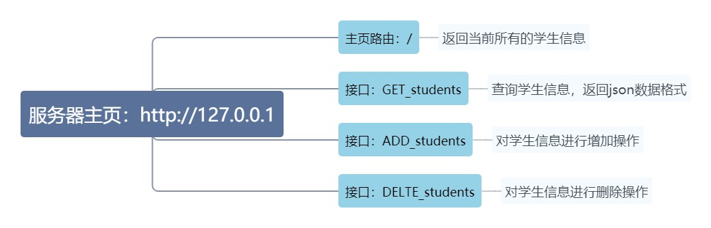

# 简介

## Server.py
是一个使用 Flask 框架编写的简单学生信息管理系统教学示例WEB服务端，可以实现查询、添加和删除学生信息的功能。该应用通过 HTTP 请求与客户端进行通信。能够对数据进行增删查改，并返回 JSON 格式的数据结果。

具体功能如下：

查询学生信息：该应用提供 GET 方法，支持根据学生 ID 进行筛选，并返回 JSON 格式的数据结果。

添加学生信息：该应用提供 POST 方法，支持向学生列表中添加新的学生信息。

删除学生信息：该应用提供 DELETE 方法，支持从学生列表中删除指定的学生信息。

使用方法:

首先需要安装 Python 和 Flask 库。

运行该应用，可以通过命令行启动，也可以在 IDE 中直接运行 Server.py 文件。

在浏览器中访问 http://localhost ，即可查看当前所有学生的信息。

在浏览器中通过 GET 方法访问 http://localhost/students 获取学生列表信息，并通过参数 id 筛选学生信息。

在浏览器中通过 POST 方法向 http://localhost/students 提交带有 id、name 和 age 字段的 JSON 数据，即可添加学生信息。

在浏览器中通过 DELETE 方法向 http://localhost/students 提交带有 id 字段的表单数据，即可删除指定的学生信息。

## AutoTest.py
是一个使用Python编写的自动化测试程序，主要用于测试本地服务器上的学生信息管理系统是否正常运行。该程序基于单元测试框架unittest和HTTP请求库requests进行开发。

程序定义了一个测试用例类 TestStudentAPI，其中包含四个测试方法：test_home()、test_get_students()、test_add_student() 和 test_delete_student()。这些测试方法分别测试了首页功能、获取学生信息、添加学生信息和删除学生信息功能是否正常。

在执行测试之前，该程序会先初始化测试环境，往本地服务器上添加三个学生记录。然后依次执行四个测试方法，并输出测试结果。

### 程序的许可证为 GPL v3.0 许可证，使用本软件需要符合该许可证下的所有条款，并保留版权声明以及许可证文本。更多细节请参考代码中的注释。
